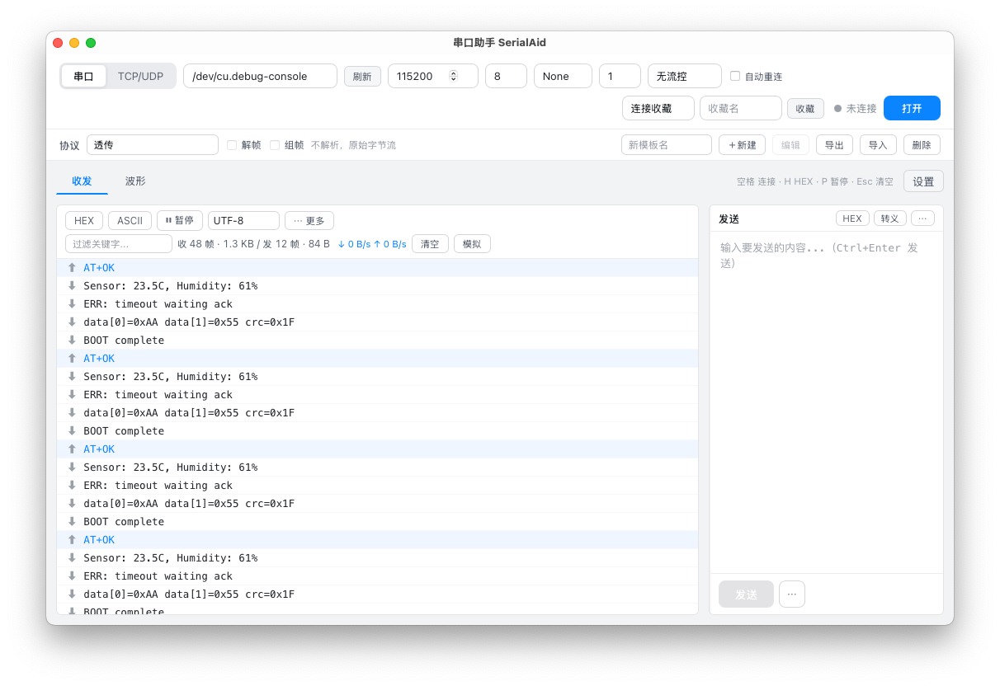

# 串口助手 SerialPortTool

[](https://tauri.app)
[](https://vuejs.org)
[](https://www.typescriptlang.org)
[](https://www.rust-lang.org)
[]()

跨平台串口 / 网络调试助手，使用 **Tauri 2 + Vue 3 + TypeScript** 从零开发。参考 [COMTool](https://github.com/Neutree/COMTool) 的功能逻辑，提供串口调试、TCP/UDP 调试、协议帧解析、波形曲线、连接配置收藏等完整能力，界面专注核心操作、低频功能折叠收纳。



## ✨ 功能特性

### 连接管理
- **串口调试**：端口自动检测 + 手动输入，波特率任意值，数据位 / 校验位 / 停止位 / 流控全配置
- **TCP / UDP 调试**：支持客户端与服务端模式、域名 / IPv4 / IPv6、UDP 客户端本地端口
- **连接配置收藏**：一键保存当前连接配置，快速切换应用，支持重命名与删除
- 空格键快速开关连接，断线状态实时提示

### 接收区
- **三种显示模式**：文本 / HEX / ASCII（不可打印字节显示为 `.`）
- **HEX + ASCII 双栏对照**：原始字节与可读字符同屏对照，方便二进制协议分析
- 行号、时间戳显示开关
- 多编码支持：UTF-8 / ASCII / GBK / GB2312 / GB18030 / UTF-16
- **关键字过滤**：按文本或 HEX 过滤接收内容，实时统计匹配条数
- **暂停缓冲模式**：暂停仅停止自动滚动，数据继续接收缓冲，恢复即回到最新
- 发送 / 接收数据块与实际线上字节数统计，实时速率（B/s）显示
- 接收日志落盘（可选，始终保存无损原始 HEX）
- TCP Server / UDP 接收显示来源地址，多客户端协议缓冲相互隔离

### 发送区
- HEX / 转义（`\n` `\r` `\xHH`）/ 自动追加换行
- **发送历史**（保留最近 20 条，可单条删除 / 清空）
- **定时发送**：可调间隔（ms），支持暂停与恢复
- **快捷指令**：常用指令一键保存、点击即发
- **文件发送**：选择文件按原始字节分块发送；与手动/定时发送互斥，不会交叉
- `Ctrl+Enter` 快捷发送

### 协议引擎
- **帧模板配置化**：帧头 / 帧尾 / 长度域 / CRC 校验 / 校验字节序 / 负载长度偏移全参数可配
- 接收侧自动解帧、CRC 校验，坏帧统计
- 发送侧自动组帧
- 模板导入 / 导出（JSON）
- 流式解帧要求模板包含长度域或帧尾；无边界 CRC 模板仅用于安全组帧

### 波形曲线
- 基于 ECharts 的实时波形显示，从接收字节流按曲线协议解析绘制
- 波形解析需明确开启；开启后切换到收发页仍持续采集，并限制曲线/点数避免失控

### 界面体验
- 深色 / 浅色主题切换
- **低频功能折叠**：不常用按钮收纳进「⋯ 更多」菜单，注意力聚焦核心操作
- 快捷键：`F5` 刷新串口、`Esc` 清空、`H` HEX 显示、`T` 时间戳、`P` 暂停、`Space` 连接开关

## 🛠 技术栈

| 层 | 技术 |
| --- | --- |
| 桌面框架 | [Tauri 2](https://tauri.app) |
| 前端 | [Vue 3](https://vuejs.org) (Composition API + `<script setup>`) |
| 状态管理 | [Pinia](https://pinia.vuejs.org) |
| 构建 | [Vite](https://vitejs.dev) + TypeScript |
| 图表 | [ECharts](https://echarts.apache.org) |
| 串口通信 | [serialport](https://crates.io/crates/serialport) (Rust) |

## 🚀 快速开始

### 环境要求

- [Node.js](https://nodejs.org) 18+
- [Rust](https://www.rust-lang.org) stable
- 对应平台的 [Tauri 系统依赖](https://tauri.app/start/prerequisites/)

### 开发调试

```bash
git clone git@github.com:MaydayV/SerialPortTool.git
cd SerialPortTool
npm install
npm run tauri dev
```

### 构建安装包

```bash
npm run tauri build
```

产物输出到 `src-tauri/target/release/bundle/`。正式 GitHub Release 目前只发布 macOS `.dmg` 和 Windows NSIS `.exe`；Linux 构建暂不作为发行资产。

### MCP / AI Agent 控制
- 内置仅 loopback 可访问的 Streamable HTTP MCP Server，AI Agent 控制正在运行的真实 GUI
- 默认 `ask` 权限模式：连接、发送、清空、切换协议等写操作必须经过用户审批
- AI 控制面板展示 endpoint、连接状态、操作时间线和待审批动作
- 支持协议模板、解帧统计、波形状态和有界波形数据读取
- macOS/Linux 提供 `serialporttool-mcp` stdio 代理和 Unix socket 本地 IPC
- 详细配置、工具列表、安全边界和当前限制见 [MCP 使用指南](docs/MCP使用指南.md)

### Mac App Store

工程包含独立的 Mac App Store 沙盒、隐私清单、签名、Universal PKG、在线验证和上传流程。先运行静态检查：

```bash
npm run appstore:check
```

证书与 provisioning profile 的准备、环境变量和 GitHub Actions Secrets 详见 [Mac App Store 发布指南](docs/MAC_APP_STORE.md)。这些账号凭据不会提交到仓库。

隐私说明见 [PRIVACY.md](PRIVACY.md)。应用不集成广告、分析或跟踪，串口与协议数据默认仅在本机处理。

## 📁 目录结构

```
SerialPortTool/
├── src/                    # 前端（Vue 3 + TS）
│   ├── components/         # 界面组件
│   │   ├── ConnectionBar.vue   # 连接配置栏
│   │   ├── ReceivePanel.vue    # 接收区
│   │   ├── SendPanel.vue       # 发送区
│   │   ├── ProtocolPanel.vue   # 协议帧面板
│   │   └── GraphPanel.vue      # 波形面板
│   ├── stores/             # Pinia 状态
│   │   ├── conn.ts         # 连接状态 / 配置收藏
│   │   ├── rx.ts           # 接收状态
│   │   ├── tx.ts           # 发送状态
│   │   ├── protocol.ts     # 协议帧引擎
│   │   ├── graph.ts        # 波形数据
│   │   └── persist.ts      # 配置持久化
│   └── utils/              # 字节 / CRC / 协议工具
├── src-tauri/              # 后端（Rust）
│   └── src/                # 串口 / IPC 实现
└── docs/                   # 文档与截图
```

## 🔑 快捷键

| 按键 | 功能 |
| --- | --- |
| `Space` | 打开 / 关闭连接 |
| `Ctrl+Enter` | 发送当前内容 |
| `F5` | 刷新串口列表 |
| `Esc` | 清空接收区 |
| `H` | 切换 HEX 显示 |
| `T` | 切换时间戳 |
| `P` | 暂停 / 继续接收 |

## 🙏 致谢

本项目的功能逻辑参考了开源项目 [COMTool](https://github.com/Neutree/COMTool) —— 一款优秀的跨平台串口调试助手。我们从其成熟的功能设计中汲取了灵感（连接管理、收发视图、协议解析等），并以 Tauri 2 + Vue 3 技术栈从零实现了本版本。

感谢 [Neucrack](https://github.com/Neutree) 及 COMTool 社区的开源贡献！
